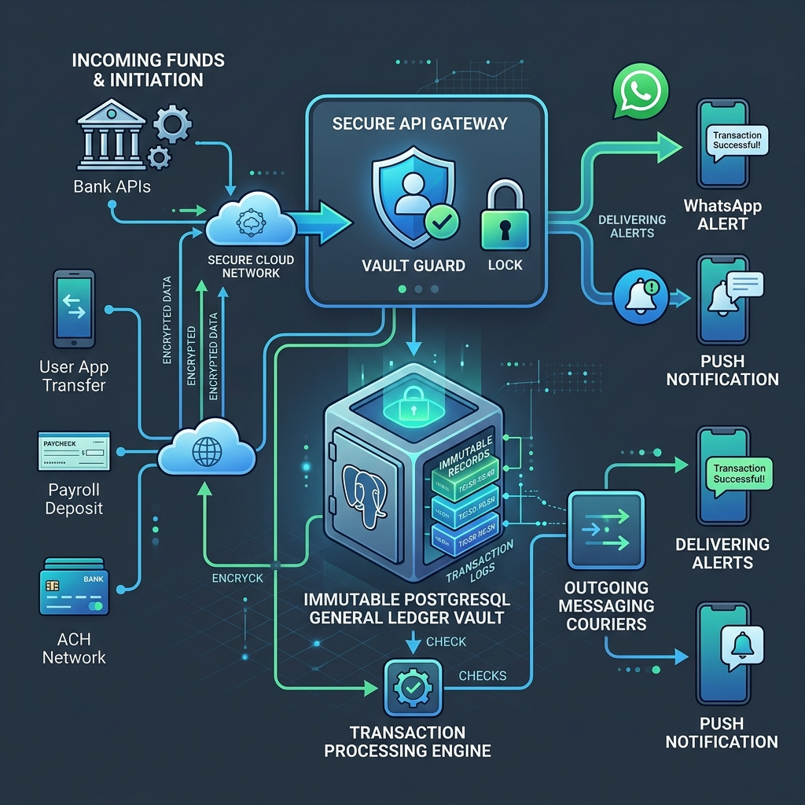
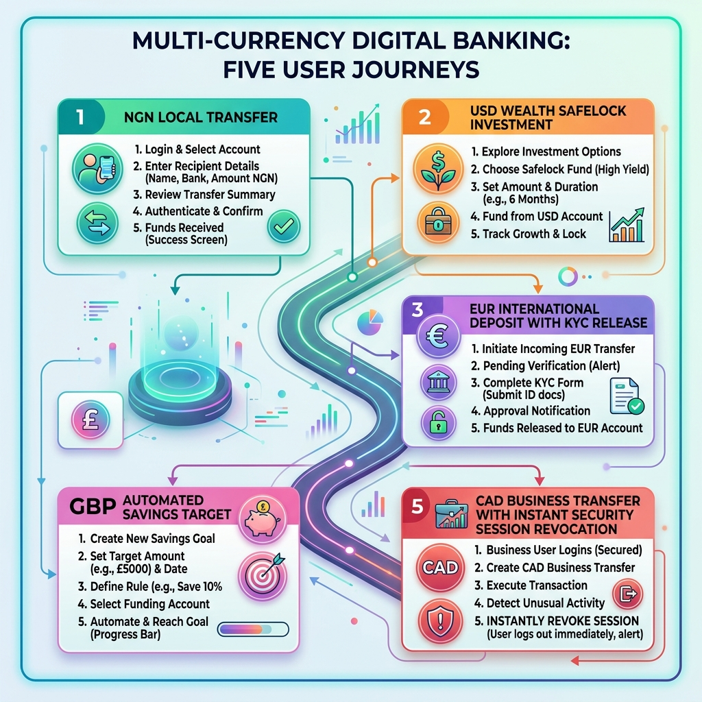

# 📄 Chapter 1: Executive & Product Overview

> **"What the Application Does & How It Breathes"**  
> *A comprehensive, plain-English blueprint for executives, product leaders, risk officers, and engineers to master the full lifecycle and business dynamics of Riverbrand.*

---

## 1.1 The "Learn, Unlearn, Relearn" Guide to Modern Banking

To truly understand digital banking, we must first discard outdated assumptions about how money and software interact.

```
┌─────────────────────────────────────────────────────────────────────────────┐
│ 🚫 UNLEARN: "Banking software is just a website with a database table."     │
│ In a naive system, changing a balance is just `balance = balance - 100`.    │
│ Reality: A user taps "Send" twice on low Wi-Fi, the query executes twice,    │
│ and the bank loses money to double-spending.                                │
├─────────────────────────────────────────────────────────────────────────────┤
│ 💡 LEARN: "Banking software is a real-time distributed consensus engine."   │
│ Every penny moved is a multi-stage atomic operation involving cryptographic │
│ authorization, distributed concurrency locks, ledger entries, and outbox.   │
├─────────────────────────────────────────────────────────────────────────────┤
│ 🚀 RELEARN & MASTER: "Riverbrand is an Omni-Channel Autonomous Bank Engine."│
│ It orchestrates Mobile, Web, and WhatsApp clients against an immutable      │
│ double-entry ledger with sub-50ms speed, zero double-spending, and auto-KYC.│
└─────────────────────────────────────────────────────────────────────────────┘
```

---

## 1.2 Executive Vision & Product Mission

The **Riverbrand Banking Platform** (`RiverbrandBE`) is a high-throughput, production-grade financial backend designed to power next-generation digital banking across mobile apps, enterprise web portals, and conversational WhatsApp banking.

Modern fintech requires systems that combine **uncompromised speed**, **absolute transaction integrity**, **strict regulatory compliance**, and **omni-channel accessibility**. Riverbrand serves as the central nervous system for all customer financial activities: money movement, wealth accumulation, identity verification, and automated customer communication.


---

## 1.3 How the System Moves: The High-Security Airport Analogy

To visualize how Riverbrand processes money securely without dropping a single cent, imagine a **World-Class International Airport & High-Security Vault**:

```
[PASSENGER ENTRANCES] ──► [CONCIERGE & QUEUE] ──► [SECURITY AIR-LOCK] ──► [MASTER VAULT] ──► [DISPATCH COURIERS]
 Mobile / Web / WhatsApp       PgBouncer Proxy       Redis Redlock Guard    PostgreSQL DB      Outbox & Alerts
```

1. **The Passenger Entrances (Multi-Channel Gateways)**: Customers arrive through different doors: iOS/Android apps, Web dashboards, or 24/7 WhatsApp chats.
2. **The Concierge & Queue Manager (PgBouncer Proxy)**: Instead of 5,000 customers rushing into the vault simultaneously and crashing the room, PgBouncer lines up requests smoothly and executes them using 50 ultra-fast teller processes.
3. **The Vault Guard (Redis Redlock & Token Bucket)**: Before anyone touches a balance, the Vault Guard grabs a distributed lock on that specific wallet key. If the user tries to send money twice in 50 milliseconds, the second attempt is locked out instantly.
4. **The Immutable Master Vault (PostgreSQL Database)**: Money moves within an atomic, single-commit transaction. A debit on one account and a credit on another happen together or not at all (ACID compliance).
5. **The Dispatch Couriers (Transactional Outbox & Notifications)**: Once sealed in the vault, background couriers deliver instant confirmation receipts via WhatsApp messages, mobile push alerts, and email notifications without making the customer wait.



---

## 1.4 Omni-Channel Tri-Client Architecture

Riverbrand is engineered as a **Unified Omni-Channel Engine**. Three distinct client channels operate harmoniously against a single ledger, lock manager, and compliance core:

```
┌─────────────────────────────────────────────────────────────────────────────────────────┐
│                                UNIFIED FASTIFY API BACKEND                              │
│         Single Ledger | Real-Time Balances | Redlock Guard | KYC Limits | Outbox        │
└─────────────────────────────────────────────────────────────────────────────────────────┘
          │                                   │                                   │
          ▼                                   ▼                                   ▼
┌───────────────────────────┐   ┌───────────────────────────┐   ┌───────────────────────────┐
│   📱 NATIVE MOBILE APP    │   │  💻 WEB PORTAL & ADMIN    │   │   💬 24/7 WHATSAPP BOT    │
│      (iOS & Android)      │   │      (Customer & Staff)   │   │   (Conversational Chat)   │
├───────────────────────────┤   ├───────────────────────────┤   ├───────────────────────────┤
│ • Biometric / Face ID Auth│   │ • Customer Web Dashboard  │   │ • Zero-Friction Onboarding│
│ • Flutterwave Card Top-up │   │ • Executive Stats Console │   │ • Conversational Transfers│
│ • Live KYC Camera Uploads │   │ • Staff User Governance   │   │ • Airtime & Utility Bills │
│ • Target Savings Trackers │   │ • Granular RBAC Matrix    │   │ • Instant Chat Receipts   │
│ • FCM Multi-Device Push   │   │ • Non-Blocking Audit Logs │   │ • Multi-Currency Inquiries│
│ • Header: `x-local-token` │   │ • Header: `x-web-token`   │   │ • Webhook HMAC Signature  │
└───────────────────────────┘   └───────────────────────────┘   └───────────────────────────┘
```

| Client Channel | Target Audience | Primary Functionality | Security & Authentication Layer |
| :--- | :--- | :--- | :--- |
| **📱 Native Mobile App** *(iOS / Android)* | Everyday retail customers, wealth builders | Full mobile banking: biometric sign-in, tokenized debit card wallet funding, live camera document uploads for Tier 3 KYC, Safelock deposits, Target Savings progress bars, FCM real-time push notifications. | `x-local-access-token` header, device hardware pairing, Argon2id passwords, 4-digit PIN bcrypt. |
| **💻 Customer Web Portal & Admin Console** | Retail web customers & Administrative staff | Customer web dashboard, full funds transfer suite, executive financial metrics, system liabilities, user suspension/unsuspension, manual KYC approvals, granular RBAC permissions (`sys_roles`), system config flags, audit logs. | `x-web-access-token` header, short-lived browser session tokens, sidecar `jwt_version` instant revocation. |
| **💬 WhatsApp Conversational Banking** | Mobile-first users, low-bandwidth customers | 24/7 conversational banking: passwordless onboarding, BVN lookup, interbank & P2P transfers, airtime/data top-up, electricity token delivery, DSTV renewals, multi-currency balance queries, instant chat receipts. | Provider HMAC-SHA256 signature verification (`x-hub-signature-256`, `X-Twilio-Signature`), 4-digit PIN auth, 3-attempt brute-force Redis lockout. |

---

## 1.5 Core Product Capabilities ("What the App Delivers")

```
┌───────────────────────────────────────────────────────────────────────────────┐
│                          8 CORE PILLARS OF RIVERBRAND                         │
├──────────────────────┬──────────────────────┬─────────────────────────────────┤
│ 1. Virtual Accounts  │ 2. Multi-Currency    │ 3. Instant Transfers (P2P/NIP)  │
│ 4. Bills & Airtime   │ 5. Wealth (Safelock) │ 6. 24/7 WhatsApp Banking        │
│ 7. Dynamic KYC Tiers │ 8. Enterprise Admin  │                                 │
└──────────────────────┴──────────────────────┴─────────────────────────────────┘
```

### 1. 💳 Digital Accounts & Dedicated Virtual NUBANs
- **Auto-Provisioning**: Upon completing user registration, the system automatically provisions dedicated Nigerian Uniform Bank Account Numbers (NUBAN) through ProvidusBank and Fincra gateways.
- **Direct Inbound Funding**: Customers receive funds from any commercial bank in Nigeria directly into their Riverbrand digital account in seconds.

### 2. 💸 Multi-Currency Wallets & Balance Ledger
- **Multi-Currency Accounts**: Provision digital wallets in NGN, USD, GBP, and EUR.
- **Dynamic FX Rates**: Calculates cross-currency conversions using centralized administrative exchange rate matrices (`ExchangeRate`).
- **Audit Ledger**: Every deposit, transfer, withdrawal, and bill payment creates immutable ledger entries (`payment_transaction` and `transactions`).

### 3. 🔄 Money Transfers & Interbank Payments
- **Interbank Transfers**: Instant clearing to any commercial bank account in Nigeria via automated clearing switches.
- **Peer-to-Peer (P2P)**: Zero-fee instant transfers between Riverbrand users using tag, username, phone, or email.
- **Smart Beneficiaries**: Automatically saves frequent commercial bank accounts, phone numbers, and P2P peers.

### 4. ⚡ Utility Bills, Airtime & Data Bundles
- **Telecom Bundles**: Instant top-up across MTN, Airtel, Glo, and 9mobile.
- **Utilities & Pay-TV**: Electricity prepaid tokens & postpaid clearing, DSTV, GOTV, Startimes, and Internet bills.
- **Instant Digital Invoices**: Automated PDF and email receipts delivered on completion.

### 5. 📈 Wealth Management: Safelock, Target Goals & AutoSave
- **Safelock Fixed Deposits**: Upfront capital lock for 30, 90, 180, or 365 days with daily compounding interest. Capital is locked until maturity, protecting user discipline and institutional liquidity reserves.
- **Target Savings Goals**: Scheduled daily, weekly, or monthly automatic sweeps toward financial goals (e.g., "Tuition Fund").
- **AutoSave Sweeps**: Periodic rule-based sweeping of idle wallet balances into high-yield savings pools.

### 6. 💬 24/7 WhatsApp Conversational Banking
- **Zero-Friction Chat Banking**: Customers execute complete banking flows inside WhatsApp without downloading an app.
- **Multi-Provider Engine**: Hot-swappable provider architecture supporting **Meta Graph API**, **Twilio Messaging**, **Termii WhatsApp**, **WATI**, **Interakt**, and **360dialog**.
- **Interactive Chat Receipts**: Inbound deposits and outbound debits push rich receipt cards directly into the conversation.

### 7. 🛡️ Dynamic Tiered KYC & Daily Limits
- **Tier 1 (Basic)**: Phone-verified signup with a daily transfer ceiling of ₦50,000.
- **Tier 2 (Identity Verified)**: BVN & NIN verification via Dojah / Mono, elevating daily limits to ₦200,000.
- **Tier 3 (Full KYC)**: Residential address verification and government photo ID (`UserDocument`), unlocking ₦5,000,000+ daily volume.
- **Pending Balance Hold**: If a user receives funds exceeding their current tier allowance, excess funds are securely locked in `rbp_brand_pending_balance` and automatically released upon KYC tier upgrade.

### 8. 📊 Enterprise Admin Console & Audit Controls
- **Staff Operations Dashboard**: Real-time overview of active users, aggregate wallet liabilities, provider reserve totals, and velocity metrics.
- **Granular RBAC**: Strict role-based permission matrices (`sys_roles`, `sys_permissions`).
- **Non-Blocking Audit Trail**: Every staff click, approval, and user login is recorded asynchronously in non-repudiable audit logs.

---

## 1.6 Step-by-Step Customer Journey

The diagram below illustrates how an everyday customer interacts with Riverbrand from initiating a chat on WhatsApp to authenticating securely and receiving instant digital confirmation receipts:


```
[1. Open WhatsApp] ──► [2. Interactive Menu] ──► [3. Enter Details] ──► [4. Enter 4-Digit PIN] ──► [5. Instant Receipt]
 "Send 5,000 to John"    Transfer / Airtime / Balance  Account / Amount     bcrypt PIN Validation       Chat Card + Push Alert
```

---

## 1.7 Five Real-World Multi-Currency Lifecycle Scenarios



### 🇳🇬 Scenario 1: NGN Local Retail User Journey
- **User Profile**: Tunde, a retail professional in Lagos.
- **Step 1 (Genesis)**: Tunde registers via WhatsApp. The system auto-provisions a dedicated ProvidusBank NUBAN (`9920123456`).
- **Step 2 (Funding)**: Tunde transfers ₦150,000 NGN from GTBank. Inbound webhook triggers atomic wallet credit, email receipt, and FCM push notification.
- **Step 3 (Everyday Banking)**: Tunde opens WhatsApp, selects "Pay Electricity", enters meter number, enters PIN, and receives his recharge token in chat in 3 seconds.

### 🇺🇸 Scenario 2: USD Cross-Border Wealth & Safelock Journey
- **User Profile**: Sarah, a tech consultant building dollar-denominated wealth.
- **Step 1 (Activation)**: Sarah activates her USD wallet inside Riverbrand.
- **Step 2 (FX Swap)**: She deposits ₦1,600,000 NGN and executes an in-app conversion to $1,000.00 USD at the active administrative exchange rate.
- **Step 3 (Safelock Fixed Deposit)**: She locks $1,000 USD into a 180-Day Safelock at 8% p.a. interest.
- **Step 4 (Automated Yield)**: The nightly cron job accrues daily interest. At maturity, $1,040 USD (principal + net interest) is credited back to her primary USD wallet.

### 🇪🇺 Scenario 3: EUR International Remittance & KYC Pending Hold
- **User Profile**: Amara, a university student receiving international funds from Europe.
- **Step 1 (Inflow)**: Amara receives a €2,500 EUR remittance from Germany.
- **Step 2 (Tier 1 Limit Trigger)**: Because Amara is Tier 1 (daily deposit limit €500 EUR equivalent), the system credits €500 EUR to her wallet and places €2,000 EUR into `rbp_brand_pending_balance`.
- **Step 3 (Auto-Release on KYC)**: Amara submits her BVN via the app. Dojah verifies her identity, upgrading her to Tier 2. The event handler (`KycTierUpgradedHandler`) automatically releases the held €2,000 EUR into her available balance.

### 🇬🇧 Scenario 4: GBP Freelancer & Automated Target Savings
- **User Profile**: David, a freelance software engineer earning in British Pounds.
- **Step 1 (Inflow)**: David receives £1,200 GBP client payment into his Riverbrand GBP account.
- **Step 2 (Target Setup)**: He creates a target savings goal: "Master's Degree - £5,000 GBP".
- **Step 3 (AutoSave Rules)**: He enables AutoSave to sweep £150 GBP every Friday from his GBP wallet into his Target Savings pool.
- **Step 4 (Goal Tracking)**: Real-time progress alerts update him via push notifications as he approaches his savings goal.

### 🇨🇦 Scenario 5: CAD Business Payment & Security Revocation Safeguard
- **User Profile**: Ken, an import-export business manager in Toronto.
- **Step 1 (Payment)**: Ken receives a $10,000 CAD invoice payment into his corporate wallet.
- **Step 2 (Security Threat)**: Ken misplaces his tablet and immediately resets his password from his laptop.
- **Step 3 (Sidecar Invalidation)**: The sidecar controller (`river_brand_sys_user_session_control`) increments `jwtVersion` from 1 to 2.
- **Step 4 (Protection Verified)**: Any stale access token on the lost tablet is rejected instantly (`401 Unauthorized`) across all API servers, safeguarding his $10,000 CAD balance.

---

## 1.8 Business Value & Key Risk Mitigations

| Business Risk | How Riverbrand Mitigates It | Plain-English Explanation |
| :--- | :--- | :--- |
| **Double-Spending & Race Conditions** | Distributed Redis Locks (`Redlock`) + SQL Transactions (`$transaction`) | Prevents a customer from tapping "Transfer" twice simultaneously on two phones to spend the same money twice. |
| **Session Hijacking / Stolen Tokens** | Dual-Token Isolation + Sidecar `jwtVersion` Invalidation | If a user loses their phone or changes their password, all active logins across all devices are cut off instantly. |
| **Third-Party Provider Outages** | Multi-Provider WhatsApp Fallback + Transactional Outbox Pattern | If one SMS, WhatsApp, or email vendor experiences downtime, the system dynamically switches to backup gateways without dropping transactions. |
| **Regulatory Non-Compliance (KYC/AML)** | Tiered Limits Tracker (`rbp_brand_daily_limit_tracker`) + Dojah BVN/NIN Gateway | Enforces exact daily transfer ceilings according to government regulations based on verified user identity level. |
| **Unauthorized Admin Abuse** | Non-Blocking Audit Trail + Granular RBAC | Ensures staff can only perform actions assigned to their exact role, and logs every staff click with timestamp and IP address. |

---

*Next Chapter: [02. Architecture & System Topology](./02-architecture-and-design.md) — Technical System Architecture & Engineering Specifications.*
