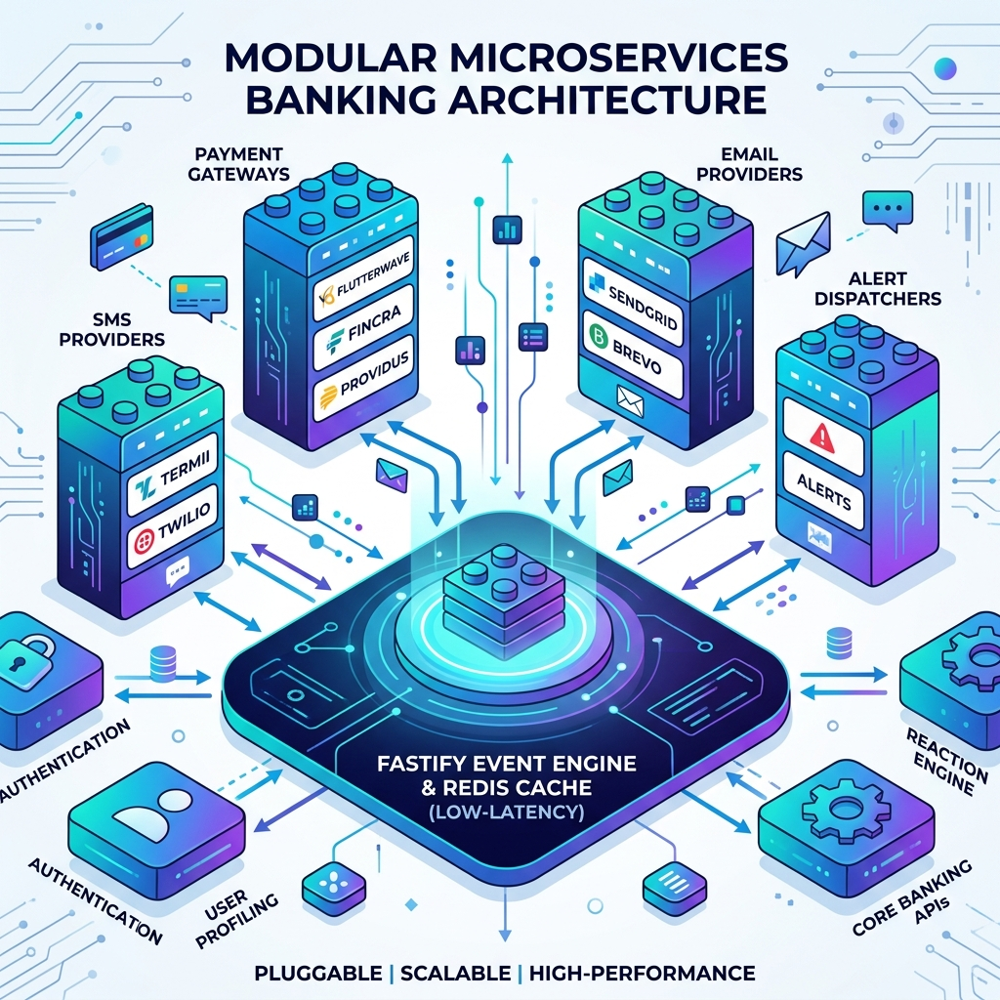
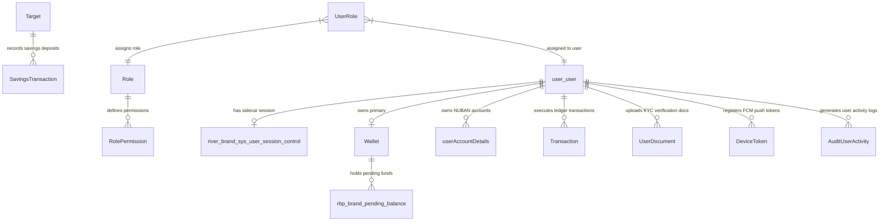

# 📄 Chapter 2: Technical Architecture & System Topology

> **"How We Achieved It"**  
> *Technical System Architecture, Pluggable Provider Design, Low-Latency Engineering, Database Modeling & Event Infrastructure.*

---

## 2.1 Technology Stack & Architectural Rationale

The Riverbrand Enterprise Digital Banking Engine (`RiverbrandBE`) is built on a high-throughput, non-blocking asynchronous architecture engineered specifically for financial technology systems.

```
┌─────────────────────────────────────────────────────────────────────────┐
│                          FASTIFY HTTP SERVER ENGINE                     │
│               Ajv JSON Schema Validation | OpenAPI 3.0 / Scalar         │
└─────────────────────────────────────────────────────────────────────────┘
                                     │
           ┌─────────────────────────┴─────────────────────────┐
           ▼                                                   ▼
┌───────────────────────┐                           ┌────────────────────┐
│   PRISMA ORM 5.x      │                           │    REDIS 7.x       │
│  PostgreSQL 15 Driver │                           │ Distributed Lock   │
└───────────────────────┘                           │ Token Bucket       │
           │                                        └────────────────────┘
           ▼
┌───────────────────────┐
│ PostgreSQL 15 Engine  │
│ ACID Compliance       │
└───────────────────────┘
```

### Stack Components & Selection Justifications

| Layer | Component | Version | Engineering Rationale |
| :--- | :--- | :--- | :--- |
| **Runtime** | Node.js | v20.x LTS | Event-driven single-threaded event loop providing high throughput for concurrent I/O-bound banking API requests. |
| **Framework** | Fastify | v4.x / v5.x | Up to 400% faster throughput than traditional Express.js. Native schema-based serialization with Ajv, zero overhead route resolution, and built-in plugin encapsulation. |
| **Language** | TypeScript | v5.3+ | Strict static typing across all request payloads, database queries, domain interfaces, and external gateway contracts, eliminating runtime type errors. |
| **Database & ORM** | PostgreSQL 15 & Prisma ORM 5.x | PostgreSQL 15<br/>Prisma 5.x | Robust relational integrity, ACID transaction guarantees, full-text search capabilities, combined with Prisma's auto-generated type-safe client and declarative migrations. |
| **Cache & In-Memory Store** | Redis | v7.x | High-speed memory storage used for Token Bucket Rate Limiting, distributed locking (`Redlock`), session cache, and active JWT blacklist storage. |
| **Dependency Injection** | TypeDI (`typedi`) | v0.10.x | Loose coupling between Controllers, Services, and Repositories via constructor-based Dependency Injection (`@Service()`). |
| **API Documentation** | `@fastify/swagger` & `@scalar/fastify-api-reference` | Latest | Auto-generated interactive OpenAPI 3.0 documentation served at `/documentation` (Swagger UI) and `/reference` (Scalar). |

---

## 2.2 Pluggable Architecture & Low-Latency Engineering

Rather than tightly coupling business rules directly to specific vendors (e.g. tying money transfers directly to a single card processor or SMS vendor), Riverbrand implements a **Pluggable Modular Design**.



### 1. Plain-English Non-Technical Explanation (The Universal Power Plug)
- **Legacy Monolith Problem (Tightly Coupled)**: In old legacy banking systems, if you wanted to switch your SMS vendor from Termii to Twilio, or change card processors from Flutterwave to Paystack, developers had to rewrite half the application code. It was like hardwiring your television directly into the wall—if you changed houses, you had to break the wall.
- **Riverbrand Pluggable Approach (Universal Plug-and-Play)**: Riverbrand acts like a **Universal Power Socket**. Payment gateways, SMS providers, email delivery services, and alerting channels are separate, standardized "plugs". Adding a new payment gateway or SMS provider requires snapping in a new adapter without touching a single line of core banking wallet code!

### 2. Deep Technical Implementation Patterns

#### A. Provider Factory & Strategy Pattern (`src/providers/` & `src/utils/sms/`)
- Payment cards and virtual accounts use factory abstractions (`cardProviderFactory.ts`).
- Core services consume standard interfaces (`ICardProvider`, `IPaymentProvider`). If Flutterwave fails or a new provider like Fincra or Providus is added, `cardProviderFactory` dynamically routes requests based on configuration without changing business service code.

#### B. Pluggable Multi-Driver Mailer & SMS Failover (`src/utils/mailing/` & `src/utils/sms/`)
- The mailer service (`Mailer.ts`) supports dynamic fallback chains: `SendGridDriver` ➔ `BrevoDriver` ➔ `SmtpDriver (Mailpit)`.
- SMS OTP routing (`src/utils/sms/index.ts`) evaluates provider availability dynamically between Termii and Twilio.

#### C. Pluggable Alert Dispatcher (`src/services/alerting/`)
- The alert service (`AlertDispatcherService.ts`) maintains a registry of receivers implementing `IAlertReceiver`.
- Alerts are broadcast concurrently to `SlackAlertReceiver`, `EmailAlertReceiver`, and `GenericWebhookAlertReceiver` without tightly binding alerting logic to HTTP route handlers.

#### D. Decoupled In-Memory Event Bus (`src/events/EventBus.ts`)
- Domain events (`UserRegistered`, `KycTierUpgraded`, `VirtualAccountCreated`, `P2PTransferDebited`) are emitted asynchronously.
- Event handlers in `src/events/handlers/` listen to events independently, allowing new background features (e.g. marketing triggers, analytics tracking) to be plugged in with zero code modifications to core controllers.

### 3. Low-Latency Engineering Performance Pillars

| Low-Latency Pillar | Implementation Detail | Performance Benefit |
| :--- | :--- | :--- |
| **Fastify JIT Schema Compilation** | Fastify pre-compiles Ajv JSON validation schemas into optimized JS functions at startup. | Eliminates JSON parsing overhead, reducing route resolution latency to sub-milliseconds. |
| **In-Memory Redis Token Bucket** | Rate limiting (`TokenBucketRateLimiter`) and lock checks execute entirely in Redis memory. | Evaluates incoming request authorization in under 2 milliseconds without hitting database disk I/O. |
| **Asynchronous Non-Blocking I/O** | Audit logs, outbox inserts, push notifications, and emails execute asynchronously outside the primary HTTP response loop. | Returns HTTP `200 OK` responses immediately to mobile app users without waiting for third-party network calls. |

---

## 2.3 Modular Monolith Architecture

The application is structured as a **Modular Monolith**. This architectural pattern provides the simplicity of a single deployable unit with the clean boundaries and modularity of microservices, making future microservice extraction straightforward when scale demands it.

### Code Directory Topography

```
RiverbrandBE/
├── Dockerfile                      # Multi-stage production container build
├── docker-compose.yml              # Local development stack (Postgres, Redis, Mailpit)
├── docker-compose.prod.yml         # Production container orchestrator
├── src/
│   ├── api/                        # HTTP Layer (Controllers, Routes, Middleware, Swagger Docs)
│   │   ├── controllers/            # Controller Request Handlers
│   │   ├── middleware/             # Auth, RBAC, Rate Limiter, Metrics Plugins
│   │   └── routes/                 # Fastify Modular Route Definitions
│   ├── config/                     # Environment Variable Validation & Client Configs
│   ├── database/                   # Persistence Layer
│   │   ├── schema.prisma           # Complete Master Prisma Schema (2,150+ lines)
│   │   ├── repository/             # Data Access Layer & Repositories
│   │   └── migrations/             # Standardized SQL Migration Files
│   ├── events/                     # Event Bus System & Domain Event Handlers
│   │   ├── EventBus.ts             # In-Memory Node EventEmitter Bus
│   │   └── handlers/               # Decoupled Domain Event Listeners
│   ├── interfaces/                 # Master TypeScript Interface Definitions
│   ├── job/                        # Cron Jobs (Outbox Processor, DLQ Replayer, Savings Interest)
│   ├── providers/                  # External Integrations (Fincra, Flutterwave, Dojah, Termii)
│   ├── schema/                     # Ajv Validation Schemas with OpenAPI Metadata
│   ├── services/                   # Business Domain Services (User, Wallet, Savings, KYC)
│   ├── utils/                      # Utilities (Logger, Locking, Crypto, Mailer)
│   └── whatsapp-banking/           # Meta Graph API Webhook & Conversational Engine
└── index.ts                        # Application Entrypoint & Lifecycle Manager
```

---

## 2.4 Database Schema & Relational Integrity

The persistence model managed in `src/database/schema.prisma` contains over 60 relational models designed to maintain strict financial consistency while preserving backward compatibility with legacy data schemas.

### Primary Domain Entity Relationships



### Key Technical Entities Summary

1. **`user_user`**: Master core user entity storing identity details, hashed authentication passwords, email, phone number, and account verification tier (`TIER1`, `TIER2`, `TIER3`).
2. **`river_brand_sys_user_session_control`**: Non-invasive sidecar table storing `jwt_version` and `last_logout_at`. Used to invalidate tokens instantly across all devices without mutating legacy user tables.
3. **`Wallet` & `userAccountDetails`**: Financial entities representing currency balances (NGN, USD, EUR) and dedicated virtual bank accounts (ProvidusBank / Fincra NUBANs).
4. **`Transaction` & `payment_transaction`**: Immutable ledger tables tracking credit, debit, transfer, and bill payment movements with unique transaction references (`ref`, `referenceId`, `extReferenceId`).
5. **`rbp_brand_pending_balance` & `rbp_brand_pending_balance_audit`**: Holds locked wallet funds that exceed user KYC daily ceilings, providing structured audit logs upon release (`rbp_brand_pending_balance_audit`).
6. **`rbp_brand_daily_limit_tracker`**: Tracks daily debit volume per user per calendar day (`YYYY-MM-DD`), enforcing tier-based compliance limits.

---

## 2.5 Transactional Outbox Pattern & Event Relay

To solve the dual-write problem (where database updates succeed but external webhook notifications fail due to network glitches), Riverbrand uses the **Transactional Outbox Pattern**.

```
[Business Operation] ──(Single DB Transaction)──► [Update Wallet Balance]
                                            └────► [Insert Outbox Record (PENDING)]
                                                               │
                                                               ▼
[Outbox Cron Processor (src/job/outbox.ts)] ◄───(Polls Every 5s)──┘
        │
        ├─────────► [Publish Notification / Call Third-Party API] ──► (Status: PUBLISHED)
        │
        └─────────► [If Failure (Attempts > 5)] ──► [Move to Dead Letter Queue (DLQ)]
                                                            │
                                                            ▼
                                           [DLQ Replayer Job (src/job/dlq.ts)]
```

### Outbox Mechanics (`rbp_brand_outbox` & `rbp_brand_deadletter`)

1. **Atomic Insertion**: When a financial event occurs (e.g., a transfer or virtual account creation), the business logic inserts a event record into `rbp_brand_outbox` within the **same SQL transaction** (`$transaction`) as the financial state mutation.
2. **Outbox Polling Worker (`src/job/outbox.ts`)**: A background cron process queries pending outbox records (`status = PENDING`) ordered by `createdAt`. It attempts to dispatch the event payload to external webhook receivers, email queues, or push notification dispatchers.
3. **Dead Letter Queue (`src/job/dlq.ts`)**: If a message fails execution after 5 exponential backoff retries, it is automatically safely routed to `rbp_brand_deadletter` with the complete stack trace and error diagnostic, where operations teams can inspect and trigger one-click manual replays.

---

## 2.6 Operational Observability & Metrics Infrastructure

Riverbrand embeds deep observability directly into the server pipeline using Prometheus metrics and Fastify hooks.

### Metrics Infrastructure Components

- **Metrics Service (`src/services/metrics/metricsService.ts`)**: Built on top of `prom-client`. Collects application metrics:
  - `http_requests_total`: Counter tracking HTTP requests by method, route, and status code.
  - `http_request_duration_seconds`: Histogram measuring API endpoint response latency percentiles (p50, p90, p99).
  - `financial_transactions_total`: Counter tracking money movement events by type (`TRANSFER`, `BILL_PAYMENT`, `SAFELOCK`) and status.
  - `outbox_pending_events_count`: Gauge tracking pending event backlog in the outbox queue.
- **Dedicated Metrics HTTP Server (`src/services/metrics/metricsServer.ts`)**: Runs on isolated internal port `9095` serving `/metrics` for Prometheus scraping without exposing metrics to public internet clients.
- **Health Diagnostics Service (`src/services/health/healthCheckService.ts`)**:
  - `/health/liveness`: Returns `200 OK` if Fastify event loop is responsive.
  - `/health/readiness`: Performs active connectivity ping tests against PostgreSQL 15, Redis 7, Mailpit SMTP, and Outbox queues.

---

## 2.7 Summary

By combining pluggable provider interfaces, TypeDI dependency injection, Fastify's JIT compilation, Redis in-memory concurrency controls, and the Transactional Outbox pattern, Riverbrand achieves an ultra-low latency, loosely coupled architecture ready for enterprise scale.

*Next Chapter: [03. Core Banking & Financial Engine](./03-core-banking-and-financial-engine.md) — Financial Ledger, Money Movement & Double-Spending Guard.*
