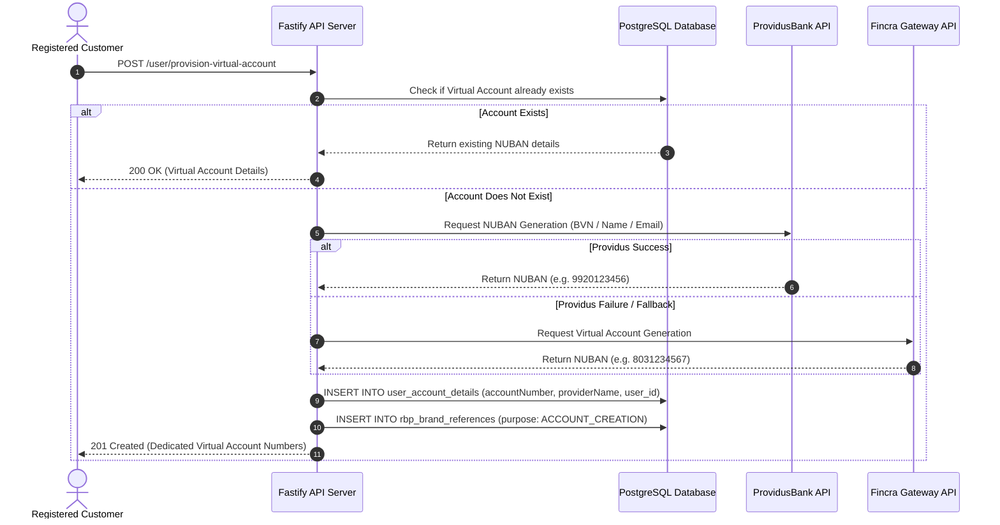

# 📄 Chapter 3: Core Banking & Financial Engine

> **"Financial Ledger, Money Movement & Double-Spending Prevention"**  
> *Deep-dive technical specification on atomic ledger debits, distributed locking, virtual NUBAN generation, pending balance locks, and daily limit tracking.*

---

## 3.1 Double-Spending Prevention & Atomic Balance Locking

In high-volume digital banking applications, race conditions pose a severe threat. For instance, if a user with ₦10,000 in their wallet submits two concurrent transfer requests of ₦10,000 simultaneously from two devices, a naive system without concurrency controls could process both requests, leading to a negative balance of -₦10,000 and institutional loss.

Riverbrand guarantees **zero double-spending** and **strict double-entry balance integrity** using a two-tier locking strategy:

```
[Incoming Debit Request] 
         │
         ▼
┌─────────────────────────────────────────────────────────┐
│ TIER 1: Distributed Redis Lock (utils/lock.ts)          │
│ Lock Key: `lock:wallet:{walletId}` (TTL: 10 Seconds)    │
└─────────────────────────────────────────────────────────┘
         │
         ├──► [Acquired Lock Successfully]
         │          │
         │          ▼
         │  ┌──────────────────────────────────────────────────────────┐
         │  │ TIER 2: Database Isolation Transaction ($transaction)    │
         │  │  1. SELECT balance FROM "Wallet" WHERE id = walletId;   │
         │  │  2. Verify: balance >= debitAmount                      │
         │  │  3. UPDATE "Wallet" SET balance = balance - debitAmount │
         │  │  4. INSERT INTO "transactions" (...)                    │
         │  │  5. COMMIT TRANSACTION                                  │
         │  └──────────────────────────────────────────────────────────┘
         │          │
         │          ▼
         │  [Release Redis Lock] ──► [Return 200 OK Response]
         │
         └──► [Lock Rejected / Busy] ──► [Return 429 / 409 Conflict Response]
```

### 1. Redis Distributed Lock (`src/utils/lock.ts`)
- Before executing any balance deduction or transfer, the financial service calls `acquireLock(`wallet:${walletId}`, ttlMs)`.
- If a lock exists for that wallet ID, subsequent incoming concurrent requests are blocked or cleanly rejected with an `HTTP 409 Conflict` ("A transaction is already in progress on this account").

### 2. Prisma Database Transaction Isolation (`$transaction`)
- Balance update logic executes within an explicit Prisma interactive transaction (`prisma.$transaction(async (tx) => { ... })`).
- The wallet row is evaluated and validated against the exact required debit amount before mutating the database balance field (`balance: { decrement: debitAmount }`).

---

## 3.2 Virtual Account Provisioning Lifecycle

Dedicated virtual bank accounts (NUBANs) allow customers to fund their Riverbrand wallets by transferring money from any commercial bank in Nigeria.

### Architecture & Gateway Integration (`src/services/userProvisioning.ts`)



---

## 3.3 Transaction Processing & Reference Tracking

Every money movement operation is assigned a cryptographically unique reference to enforce **idempotency** and prevent duplicate billing across retries.

### Reference System Architecture (`src/utils/referenceGenerator.ts`)

The reference system (`rbp_brand_references`) stores and tracks payment references across six distinct operational purposes:

| Purpose (`ReferencePurpose`) | Format Example | Description |
| :--- | :--- | :--- |
| `ACCOUNT_CREATION` | `REF-ACT-20260815-9A8B7C` | Dedicated NUBAN virtual account creation reference. |
| `TRANSFER` | `TRF-NGN-20260815-88392011` | Interbank or P2P transfer reference. |
| `DEPOSIT` | `DEP-PRV-20260815-77182900` | Inbound deposit webhook reference from Providus/Fincra. |
| `SAVINGS` | `SAV-FLK-20260815-33411099` | Safelock or Target Savings deposit lock reference. |
| `BILL_PAYMENT` | `BIL-AIR-20260815-44910288` | Airtime, Data, Electricity, or Cable TV bill payment ref. |
| `CARD_PAYMENT` | `CRD-FLW-20260815-11029388` | Debit card funding transaction reference. |

---

## 3.4 Pending Balance Holding & Release Engine

To comply with anti-money laundering (AML) and identity tier regulations, funds deposited into a customer's wallet that exceed their current identity verification limit are automatically held in a **Pending Balance Pool** (`rbp_brand_pending_balance`).

```
[Inbound Deposit Webhook (e.g. ₦500,000)]
                   │
                   ▼
┌────────────────────────────────────────────────────────┐
│ Check User KYC Tier Daily Ceiling (rbp_brand_kyc_benefit)│
│ Current User Tier: TIER 1 (Daily Limit: ₦50,000)       │
└────────────────────────────────────────────────────────┘
                   │
         ┌─────────┴─────────┐
         ▼                   ▼
[Within Limit: ₦50,000]   [Exceeds Limit: ₦450,000]
         │                   │
         ▼                   ▼
[Credit Main Wallet]     [Lock in `rbp_brand_pending_balance`]
                             │
                             ▼
                         [Log Audit Trail (`rbp_brand_pending_balance_audit`)]
                             │
                             ▼
       [Customer Uploads BVN / NIN ➔ Upgraded to TIER 2]
                             │
                             ▼
             [Pending Balance Auto-Released to Main Wallet]
```

### Technical Workflow (`src/services/monetary/pendingBalance.ts`)

1. **Limit Evaluation**: When a deposit arrives, `FinancialEngine` compares the user's total debits/credits for the current calendar day against their tier limit in `rbp_brand_kyc_benefit`.
2. **Pending Hold Insertion**: Any excess balance is written to `rbp_brand_pending_balance` with status `PENDING`.
3. **Audit Log Trail**: An entry is appended to `rbp_brand_pending_balance_audit` recording `action = INITIAL_HOLD`, `previousRemaining`, `newRemaining`, and `tierAtTime`.
4. **Automated Tier Upgrade Trigger (`src/events/handlers/KycTierUpgradedHandler.ts`)**: Upon successful verification of BVN, NIN, or Tier 3 address documents, the system triggers `releasePendingBalances(userId)`, releasing the locked funds into the user's available wallet balance automatically.

---

## 3.5 Daily Limits & Tier Compliance Tracking

The system tracks daily transaction volume per user using `rbp_brand_daily_limit_tracker`.

### Daily Limit Table Structure

```prisma
model rbp_brand_daily_limit_tracker {
  id          String    @id @default(uuid()) @db.Uuid
  userId      BigInt    @map("user_id")
  date        String    @db.VarChar(10) // Format: "YYYY-MM-DD"
  totalDebits Decimal   @default(0) @map("total_debits") @db.Decimal(20, 2)
  updatedAt   DateTime  @updatedAt @map("updated_at") @db.Timestamptz(6)

  @@unique([userId, date])
}
```

### KYC Tier Default Ceilings (`rbp_brand_kyc_benefit`)

| User KYC Tier | Daily Transfer Limit | Maximum Wallet Balance | Required Verification Items |
| :--- | :--- | :--- | :--- |
| **`TIER1`** | ₦50,000.00 | ₦300,000.00 | Verified Phone Number & Email |
| **`TIER2`** | ₦200,000.00 | ₦500,000.00 | BVN or NIN Verification via Dojah Gateway |
| **`TIER3`** | ₦5,000,000.00 | Unlimited | Government Photo ID & Proof of Address Upload |

---

## 3.6 Summary

Through Redis distributed locks (`Redlock`), Prisma `$transaction` SQL isolation, multi-gateway virtual account provisioning, reference tracking, and automated pending balance holds, Riverbrand delivers banking-grade double-spending prevention and financial compliance.

*Next Chapter: [04. Savings, WhatsApp & Channels](./04-savings-investments-and-channels.md) — Wealth Engine, WhatsApp Banking & FCM Notifications.*
