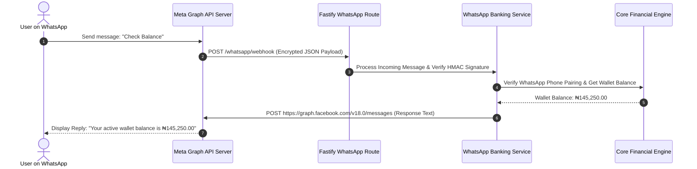

# 📄 Chapter 4: Savings, WhatsApp Banking & Channel Integration

> **"Wealth Engine, Conversational Banking & Push Notifications"**  
> *Detailed technical specification on Safelock yield calculations, Meta WhatsApp Graph API webhooks, and FCM multi-platform push notification dispatch.*

---

## 4.1 Wealth Management Engine: Safelock, Target Savings & AutoSave

The wealth engine (`src/services/monetary/savings/savings.ts`) enables retail customers to save disciplined funds and earn competitive compounding interest yields while providing the platform with predictable liquidity reserves.

```
┌────────────────────────────────────────────────────────────────────────┐
│                        RIVERBRAND WEALTH ENGINE                        │
└────────────────────────────────────────────────────────────────────────┘
                                     │
           ┌─────────────────────────┼─────────────────────────┐
           ▼                         ▼                         ▼
┌─────────────────────┐   ┌─────────────────────┐   ┌────────────────────┐
│  SAFELOCK DEPOSITS  │   │   TARGET SAVINGS    │   │  AUTOSAVE SWEEPS   │
│ • Locked Tenures    │   │ • Goal-Based        │   │ • Daily/Weekly     │
│ • Guaranteed Yield  │   │ • Scheduled Debits  │   │ • Wallet Sweeps    │
└─────────────────────┘   └─────────────────────┘   └────────────────────┘
```

### 1. Safelock Fixed Deposit Engine
- **Upfront Capital Locking**: Customer funds are debited from the main wallet (`Wallet`) and locked inside a `Target` record where `savingsType = SAFELOCK`.
- **Compound Interest Calculation Formula**:
  $$\text{Daily Yield} = \frac{\text{Principal Amount} \times \text{Annual Interest Rate (\%)}}{365 \times 100}$$
- **Daily Interest Accrual Job (`src/job/savings.ts`)**: Runs every night at 00:00 UTC. Iterates through active locked deposits, calculates the daily yield, updates `currentAmount`, and records an entry in `savings_usersavinginterestlog`.
- **Maturity Auto-Payout (`src/events/handlers/SafelockMaturedHandler.ts`)**: On the maturity date (`endDate`), the principal plus net accrued interest is credited back to the customer's primary wallet automatically.
- **Early Breakage Penalty Math**: If a customer requests emergency liquidation prior to maturity, a breakage penalty rate (`breakage_rate`, typically 20-30% of accrued interest) and government tax (`govern_withdrawal_tax_amount`) are deducted, returning only net principal + remaining interest.

---

## 4.2 Meta WhatsApp Conversational Banking Engine

Riverbrand features an automated conversational banking engine built directly on Meta's WhatsApp Graph API (`src/whatsapp-banking/`).

### Architecture & Webhook Communication Flow



### Key Technical Features of WhatsApp Banking (`src/whatsapp-banking/services/WhatsAppBankingService.ts`)

1. **HMAC Webhook Security Verification**: Verifies `x-hub-signature-256` header on every incoming Meta HTTP request using the shared app secret to reject spoofed webhooks.
2. **Phone Number Pairing & Verification**: Maps the WhatsApp sender ID (`WA_ID`) to registered users in `user_user`. If the phone is unregistered, the engine prompts for secure passwordless verification.
3. **Conversational State Machine**: Supports interactive menu buttons, numerical selection menus, and text command parsing:
   - Option 1: Balance & Dashboard Summary
   - Option 2: Interbank Transfer
   - Option 3: Airtime & Data Purchase
   - Option 4: Transaction Dispute & Support Ticket Creation
4. **PIN Validation for Financial Operations**: High-risk financial operations (e.g. transfers over WhatsApp) require the user to input a 4-digit transaction PIN, which is validated using bcrypt/argon2 before executing the transaction.

---

## 4.3 FCM Multi-Platform Push Notification Pipeline

The platform supports real-time push notifications across Android, iOS, and Web devices using Google Firebase Cloud Messaging (FCM) (`src/services/PushNotificationService.ts`).

### Multi-Device Registration & Invalidation Architecture

```
[Mobile / Web Client] ──► POST /user/device-token ──► [Save in `sys_device_tokens`]
                                                               │
                                                               ▼
[Transaction Event Occurs] ──► [PushNotificationService.sendToUser(userId, title, body)]
                                                               │
                                                               ▼
                                             [Firebase Admin SDK Dispatch]
                                                               │
                                         ┌─────────────────────┴─────────────────────┐
                                         ▼                                           ▼
                                 [Device Online]                             [Device Uninstalled]
                                         │                                           │
                                         ▼                                           ▼
                             [Deliver Push Alert]                    [FCM Error: `registration-token-not-registered`]
                                                                                     │
                                                                                     ▼
                                                                     [Auto-deactivate token (`is_active = false`)]
```

### Push Token Data Model (`sys_device_tokens`)

```prisma
model DeviceToken {
  id          BigInt             @id @default(autoincrement())
  user_id     BigInt
  token       String             @unique @db.VarChar(500)
  platform    PushDevicePlatform @default(ANDROID) // WEB, IOS, ANDROID
  device_id   String?            @db.VarChar(100)
  app_version String?            @db.VarChar(50)
  is_active   Boolean            @default(true)
  created_at  DateTime           @default(now()) @db.Timestamptz(6)
  updated_at  DateTime           @updatedAt @db.Timestamptz(6)

  @@index([user_id, is_active])
}
```

### Self-Healing Token Invalidation
When an FCM push dispatch fails with an error code such as `messaging/registration-token-not-registered` or `messaging/invalid-registration-token` (indicating the user uninstalled the app or invalidated the token), `PushNotificationService` automatically sets `is_active = false` for that device token record. This prevents future wasted network calls and optimizes push delivery rates.

---

## 4.4 Multi-Channel Notification Dispatcher

The application includes a unified notification dispatcher (`src/events/handlers/NotificationDispatchedHandler.ts`) that orchestrates alerts across three concurrent channels:

| Notification Channel | Delivery Mechanism | Fallback Handling |
| :--- | :--- | :--- |
| **FCM Push Notification** | Firebase Admin SDK (`sys_device_tokens`) | Self-healing invalidation on uninstall. |
| **Email SMTP Alert** | Mailpit (Dev) / SendGrid / Brevo (Prod) | Retried automatically via Outbox Queue. |
| **In-App Notification Center** | `Notification` Table in Database | Persisted for in-app inbox display (`isRead = false`). |

---

## 4.5 Summary

By combining compounding Safelock yields, Meta Graph API WhatsApp conversational banking, and FCM self-healing push notifications, Riverbrand delivers a rich multi-channel digital banking experience.

*Next Chapter: [05. Security, Revocation & Auditing](./05-security-compliance-and-auditing.md) — Dual-Token Security, Sidecar Revocation, RBAC & Audit Trails.*
