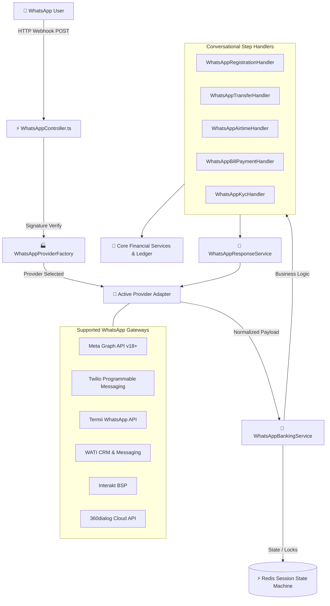

# 📄 Chapter 4: Savings, WhatsApp Banking & Channel Integration

> **"Wealth Engine, Multi-Provider Conversational Banking & Push Notifications"**  
> *Detailed technical specification on Safelock yield calculations, multi-provider WhatsApp engine (Meta, Twilio, Termii, Wati, Interakt, 360dialog), Redis conversational state machines, and FCM push dispatch.*

---

## 4.1 The "Learn, Unlearn, Relearn" Guide to Conversational Channels

```
┌─────────────────────────────────────────────────────────────────────────────┐
│ 🚫 UNLEARN: "Building a WhatsApp bot is just a 2,000-line switch statement."│
│ Storing conversational state in database rows or memory variables leads to  │
│ slow response times, race conditions, dropped chats, and bot amnesia.       │
├─────────────────────────────────────────────────────────────────────────────┤
│ 💡 LEARN: "Conversational banking is a distributed finite-state machine."   │
│ Every user phone has an active state in Redis (`wa:session:{phone}`) with a │
│ 30-minute rolling TTL, strict step transition enums, and message dedupe.    │
├─────────────────────────────────────────────────────────────────────────────┤
│ 🚀 RELEARN & MASTER: "Riverbrand's Multi-Provider Conversational Core"      │
│ We abstract Meta, Twilio, Termii, and WATI behind `IWhatsAppProvider`.      │
│ Inbound webhooks verify HMAC signatures, fetch session state, execute the   │
│ domain handler, validate PIN via bcrypt, and reply with interactive buttons.│
└─────────────────────────────────────────────────────────────────────────────┘
```

---

## 4.2 Wealth Management Engine: Safelock, Target Savings & AutoSave

The wealth engine (`src/services/monetary/savings/savings.ts`) enables retail customers to save disciplined funds and earn competitive compounding interest yields while providing the platform with predictable liquidity reserves.

```
┌────────────────────────────────────────────────────────────────────────┐
│                        RIVERBRAND WEALTH ENGINE                        │
│               Compounding Interest Engine & Scheduled Sweeps           │
└────────────────────────────────────────────────────────────────────────┘
                                     │
           ┌─────────────────────────┼─────────────────────────┐
           ▼                         ▼                         ▼
┌─────────────────────┐   ┌─────────────────────┐   ┌────────────────────┐
│  SAFELOCK DEPOSITS  │   │   TARGET SAVINGS    │   │  AUTOSAVE SWEEPS   │
│ • Locked Tenures    │   │ • Goal-Based        │   │ • Daily/Weekly     │
│ • Guaranteed Yield  │   │ • Scheduled Debits  │   │ • Wallet Sweeps    │
└─────────────────────┘   └─────────────────────┘   └────────────────────┘
```

### 1. Safelock Fixed Deposit Engine
- **Upfront Capital Locking**: Customer funds are debited from the main wallet (`Wallet`) and locked inside a `Target` record where `savingsType = SAFELOCK`.
- **Compound Interest Calculation Formula**:
  $$\text{Daily Yield} = \frac{\text{Principal Amount} \times \text{Annual Interest Rate (\%)}}{365 \times 100}$$
- **Daily Interest Accrual Job (`src/job/savings.ts`)**: Runs every night at 00:00 UTC. Iterates through active locked deposits, calculates the daily yield, updates `currentAmount`, and records an entry in `savings_usersavinginterestlog`.
- **Maturity Auto-Payout (`src/events/handlers/SafelockMaturedHandler.ts`)**: On the maturity date (`endDate`), the principal plus net accrued interest is credited back to the customer's primary wallet automatically.
- **Early Breakage Penalty Math**: If a customer requests emergency liquidation prior to maturity, a breakage penalty rate (`breakage_rate`, typically 20-30% of accrued interest) and government tax (`govern_withdrawal_tax_amount`) are deducted, returning only net principal + remaining interest.

---

## 4.3 Multi-Provider WhatsApp Conversational Banking Engine

Riverbrand features an enterprise-grade conversational banking engine (`src/whatsapp-banking/`) designed with a **Pluggable Multi-Provider Architecture**. Rather than hardcoding the banking logic to a single WhatsApp BSP (Business Solution Provider), Riverbrand exposes a unified contract (`IWhatsAppProvider`) allowing dynamic runtime switching across providers.



### Supported WhatsApp Provider Integrations

| Provider Adapter (`src/whatsapp-banking/providers/`) | Primary Use Case | Signature Verification Mechanism | Message Types Supported |
| :--- | :--- | :--- | :--- |
| **`MetaWhatsAppProvider`** | Official Meta Graph Cloud API (Direct) | `x-hub-signature-256` HMAC-SHA256 | Text, Interactive Buttons, Lists, Flows, Templates |
| **`TwilioWhatsAppProvider`** | Global Twilio Messaging & Twilio Studio Flows | `X-Twilio-Signature` HMAC-SHA1 | Text, Media, Twilio Studio Webhooks, Templates |
| **`TermiiWhatsAppProvider`** | African Regional Telco Gateway | Termii API Token / Bearer Header | Text, Media, Interactive Menus |
| **`WatiWhatsAppProvider`** | WATI Customer Engagement Platform | WATI Webhook Token | Text, Buttons, Templates, Media |
| **`InteraktWhatsAppProvider`** | Interakt Omnichannel Platform | Interakt Signature Header | Text, Interactive Lists, Quick Replies |
| **`ThreeSixtyDialogProvider`** | High-Throughput 360dialog Cloud API | 360dialog Client API Key | Text, Buttons, Lists, Media, Flows |

---

## 4.4 Redis-Backed Conversational State Machine (`WhatsAppSessionService`)

Conversational banking requires tracking state across multiple chat interactions while maintaining low latency and zero database bloat. Riverbrand uses **Redis in-memory caching** (`src/whatsapp-banking/services/WhatsAppSessionService.ts`) to manage session lifecycles.

### Session Lifecycle & Data Model

```typescript
export interface WhatsAppUserSession {
  phoneNumber: string;                // e.g. "2348012345678"
  step: WhatsAppStep;                 // Current conversational state enum
  authenticated: boolean;             // True if phone maps to verified user
  userId?: string;                    // Linked database user_user ID
  userFullName?: string;              // Customer display name
  failedPinAttempts: number;          // Counter for brute-force prevention
  sessionData: Record<string, any>;   // Dynamic step cache (e.g. transfer amount, bank, recipient)
  lastActivity: number;               // Unix timestamp (ms)
}
```

### Redis Key Layout & TTL Rules

- **Active Session**: `wa:session:{cleanPhoneNumber}` — TTL: `1800 seconds` (30 minutes). Reset on every inbound message.
- **Message Deduplication**: `wa:msg:{messageId}` — TTL: `86400 seconds` (24 hours). Prevents duplicate processing of webhook retries.
- **Security Lockout**: `wa:lockout:{cleanPhoneNumber}` — TTL: `1800 seconds` (30 minutes). Automatically set when `failedPinAttempts >= 3`.
- **Global Reset Keywords**: Sending `HI`, `HELLO`, `MENU`, `MAIN`, `START`, `CANCEL`, `RESET`, or `EXIT` instantly clears step memory and returns the customer to the top-level main menu (`WhatsAppStep.IDLE`).

---

## 4.5 Conversational Step Handlers Deep Dive

```
                               ┌───────────────────────────────────┐
                               │     INCOMING WHATSAPP MESSAGE     │
                               └───────────────────────────────────┘
                                                 │
                                                 ▼
                               ┌───────────────────────────────────┐
                               │    WhatsAppBankingService.ts      │
                               │  Evaluates session.step in Redis  │
                               └───────────────────────────────────┘
                                                 │
         ┌───────────────────┬───────────────────┼───────────────────┬───────────────────┐
         ▼                   ▼                   ▼                   ▼                   ▼
┌─────────────────┐ ┌─────────────────┐ ┌─────────────────┐ ┌─────────────────┐ ┌─────────────────┐
│  REGISTRATION   │ │    TRANSFERS    │ │ AIRTIME & DATA  │ │  BILL PAYMENTS  │ │ KYC & BALANCES  │
│     HANDLER     │ │     HANDLER     │ │     HANDLER     │ │     HANDLER     │ │     HANDLER     │
└─────────────────┘ └─────────────────┘ └─────────────────┘ └─────────────────┘ └─────────────────┘
```

### 1. `WhatsAppRegistrationHandler` (`WhatsAppRegistrationHandler.ts`)
Allows prospective customers to complete frictionless KYC onboarding without ever downloading the native mobile app:
1. **Name Capture (`REGISTRATION_NAME`)**: User enters First and Last Name.
2. **Email Capture & OTP (`REGISTRATION_EMAIL` & `REGISTRATION_EMAIL_OTP`)**: Dispatches a 6-digit cryptographic OTP to the email.
3. **BVN Verification (`REGISTRATION_BVN`)**: Queries Dojah Identity Gateway to verify identity against national database.
4. **Selfie Capture (`REGISTRATION_SELFIE`)**: User takes a photo inside WhatsApp, uploaded to secure cloud storage.
5. **Set 4-Digit PIN (`REGISTRATION_SET_PIN`)**: Hashes transaction PIN using bcrypt/argon2.
6. **Instant NUBAN Provisioning**: Automatically triggers `UserProvisioningService`, creating a dedicated Providus/Fincra bank account and sending an interactive welcome card.

### 2. `WhatsAppTransferHandler` (`WhatsAppTransferHandler.ts`)
Powers instant P2P and Interbank transfers:
1. **Account Entry / Beneficiary Selection (`TRANSFER_ENTER_ACCOUNT`)**: Prompts user for 10-digit NUBAN or saved beneficiary.
2. **Bank Selection & Name Inquiry (`TRANSFER_SELECT_BANK`)**: Resolves account name dynamically against Nigerian interbank clearing switch.
3. **Currency & Amount Entry (`TRANSFER_SELECT_CURRENCY` & `TRANSFER_ENTER_AMOUNT`)**: Selects wallet (NGN, USD, EUR, GBP) and debit amount.
4. **PIN Authorization (`TRANSFER_ENTER_PIN`)**: Verifies 4-digit PIN with brute-force lockout protection.
5. **Atomic Execution**: Calls `FinancialEngine` with distributed Redlock locking, producing an instant digital receipt card on WhatsApp.

### 3. `WhatsAppAirtimeHandler` (`WhatsAppAirtimeHandler.ts`)
1. **Recipient & Network**: Top-up for self or enter 3rd-party number; auto-detects telco (MTN, Airtel, Glo, 9mobile).
2. **Amount / Data Plan Selection**: Dynamic data plan lists retrieved directly from VTU providers.
3. **PIN Authorization & Instant Top-up**: Executes wallet debit and delivers mobile value in seconds.

### 4. `WhatsAppBillPaymentHandler` (`WhatsAppBillPaymentHandler.ts`)
1. **Category Selection**: Electricity (Prepaid / Postpaid), Cable TV (DSTV, GOTV, Startimes), Internet, Betting.
2. **Meter / Smartcard Validation**: Live account lookup verifying meter owner name before taking payment.
3. **PIN Authorization & Token Delivery**: Generates prepaid 20-digit recharge tokens directly in the chat window.

### 5. `WhatsAppKycHandler` (`WhatsAppKycHandler.ts`)
1. **Identity Upgrades**: Enter NIN or upload utility bills via chat to upgrade to Tier 2 and Tier 3.
2. **Multi-Currency Balances**: Instant display of active balances across NGN, USD, EUR, and GBP wallets with recent transaction summaries.

---

## 4.6 FCM Multi-Platform Push Notification Pipeline

```
┌─────────────────────────────────────────────────────────────────────────────┐
│ 🧠 MENTAL MODEL: Self-Healing Push Registry                                 │
│                                                                             │
│ When an app is uninstalled, Google FCM returns `token-not-registered`.      │
│ Instead of continuously spamming dead tokens, Riverbrand intercepts the     │
│ error and sets `is_active = false`, saving bandwidth and CPU cycles!        │
└─────────────────────────────────────────────────────────────────────────────┘
```

```
[Mobile / Web Client] ──► POST /user/device-token ──► [Save in `sys_device_tokens`]
                                                               │
                                                               ▼
[Transaction Event Occurs] ──► [PushNotificationService.sendToUser(userId, title, body)]
                                                               │
                                                               ▼
                                             [Firebase Admin SDK Dispatch]
                                                               │
                                         ┌─────────────────────┴─────────────────────┐
                                         ▼                                           ▼
                                 [Device Online]                             [Device Uninstalled]
                                         │                                           │
                                         ▼                                           ▼
                             [Deliver Push Alert]                    [FCM Error: `registration-token-not-registered`]
                                                                                     │
                                                                                     ▼
                                                                     [Auto-deactivate token (`is_active = false`)]
```

---

## 4.7 Multi-Channel Notification Matrix

| Notification Channel | Delivery Mechanism | Fallback Handling |
| :--- | :--- | :--- |
| **WhatsApp Chat Alerts** | Active WhatsApp Provider (`IWhatsAppProvider`) | Retried via Transactional Outbox. |
| **FCM Push Notification** | Firebase Admin SDK (`sys_device_tokens`) | Self-healing invalidation on uninstall. |
| **Email SMTP Alert** | Mailpit (Dev) / SendGrid / Brevo (Prod) | Retried automatically via Outbox Queue. |
| **In-App Notification Center** | `Notification` Table in Database | Persisted for in-app inbox display (`isRead = false`). |

---

*Next Chapter: [05. Security, Revocation & Auditing](./05-security-compliance-and-auditing.md) — Dual-Token Security, Sidecar Revocation, RBAC & Audit Trails.*
