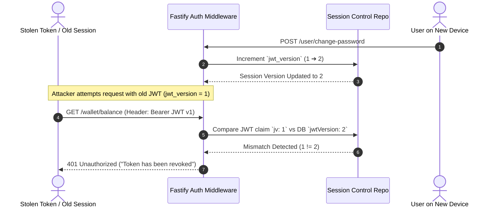

# 📄 Chapter 5: Security, Revocation & Auditing

> **"Enterprise Security Architecture & Instant Revocation"**  
> *Technical specification on Dual-Token isolation, sidecar session invalidation, PIN security, multi-channel OTP, RBAC, and non-blocking audit logging.*

---

## 5.1 Dual-Token Client Type Isolation

To protect mobile clients from web-based cross-site vulnerabilities (and vice versa), Riverbrand enforces **Dual-Token Client Type Isolation** at the authentication middleware layer (`src/api/middleware/auth.ts`).

```
                              [Incoming HTTP Request]
                                         │
                                         ▼
                   ┌───────────────────────────────────────────┐
                   │ Evaluates Headers in auth.ts Middleware   │
                   └───────────────────────────────────────────┘
                                         │
                 ┌───────────────────────┴───────────────────────┐
                 ▼                                               ▼
   [Mobile Native Request Header]                  [Web Console Request Header]
   • `x-local-access-token: <TOKEN>`               • `x-web-access-token: <TOKEN>`
   • OR `x-access-token` + `x-client-type: mobile` • OR `x-access-token` + `x-client-type: web`
                 │                                               │
                 ▼                                               ▼
   [Validate Token against Mobile Auth Schema]     [Validate Token against Web Auth Schema]
```

### Security Benefits of Dual-Token Isolation

1. **Origin Verification**: Prevents token reuse across web and native mobile clients. A token extracted from a web browser console cannot be used to authenticate native mobile API endpoints.
2. **Contextual Expiry Controls**: Web tokens are configured with shorter expiration windows (e.g. 15 minutes) suitable for browser sessions, while mobile native tokens use long-lived refresh patterns tied to device hardware identifiers.

---

## 5.2 Sidecar Session Control & Instant Token Revocation

A common flaw in stateless JWT authentication is the inability to revoke tokens immediately when a user changes their password, resets security credentials, or reports a lost phone.

Riverbrand solves this without altering legacy user database tables by implementing a **Sidecar Session Control Model** (`river_brand_sys_user_session_control`).

```prisma
model river_brand_sys_user_session_control {
  id           BigInt    @id @default(autoincrement())
  userId       BigInt    @unique @map("user_id")
  jwtVersion   Int       @default(1) @map("jwt_version") // Incremented on password change
  lastLogoutAt DateTime? @map("last_logout_at") @db.Timestamptz(6)
  updatedAt    DateTime  @updatedAt @map("updated_at") @db.Timestamptz(6)

  user         user_user @relation(fields: [userId], references: [id], onDelete: Cascade)
}
```

### Instant Revocation Execution Flow (`src/utils/jwt.ts`)



### Key Technical Properties

- **Instant Global Cut-Off**: When a user changes their password or clicks "Log Out All Devices", `jwtVersion` is incremented. All issued active JWT tokens containing the old `jv` payload claim are rejected across all servers immediately.
- **Legacy Schema Safety**: The primary `user_user` table structure remains completely untouched, eliminating breaking changes to legacy components while embedding security sidecar controls.

---

## 5.3 Password & Transaction PIN Security

The platform maintains two distinct authorization factors:

### 1. Account Password Hashing (`src/utils/password.ts`)
- Uses **Argon2id** (with fallback to bcrypt `saltRounds = 12`).
- Provides memory-hard hashing resistant to GPU-accelerated brute-force attacks.

### 2. Transaction PIN Hashing (`src/utils/pinSecurity.ts`)
- Requires a secret 4-digit numeric PIN for high-risk operations (transfers, bill payments, Safelock liquidations).
- Hashed independently of the account password using bcrypt with salt rounds.
- **WhatsApp & Mobile Lockout Guard**: Blocked after 3 consecutive invalid attempts for 30 minutes in Redis (`wa:lockout:{phone}`) to mitigate brute-force guessing.

---

## 5.4 WhatsApp Webhook Security & Cryptographic Verification

Because WhatsApp webhooks handle incoming financial commands and sensitive personal data, Riverbrand enforces strict cryptographic signature verification on every incoming HTTP payload (`src/whatsapp-banking/`):

```
[Inbound Webhook Request] ──► [Fastify Pre-Handler Hook]
                                       │
                                       ▼
                     ┌───────────────────────────────────┐
                     │ Evaluate Provider-Specific Secret │
                     └───────────────────────────────────┘
                                       │
            ┌──────────────────────────┴──────────────────────────┐
            ▼                                                     ▼
 [Meta Webhook Request]                                [Twilio Webhook Request]
 • Header: `x-hub-signature-256`                       • Header: `X-Twilio-Signature`
 • Algorithm: HMAC-SHA256(payload, APP_SECRET)         • Algorithm: HMAC-SHA1(url + params, AUTH_TOKEN)
            │                                                     │
            └──────────────────────────┬──────────────────────────┘
                                       │
                                       ▼
                     ┌───────────────────────────────────┐
                     │ Match Computed Hash == Header?    │
                     └───────────────────────────────────┘
                                       │
                     ├──► [MATCH]   ──► [Process Banking Logic]
                     │
                     └──► [MISMATCH] ─► [Reject HTTP 403 Forbidden]
```

### 1. Meta Webhook Verification (`MetaWhatsAppProvider.ts`)
- **Subscription Handshake**: Responds to Meta `GET /webhook` verification requests validating `hub.verify_token` against `WHATSAPP_VERIFY_TOKEN` and returning `hub.challenge`.
- **Payload HMAC Verification**: Inbound `POST /webhook` messages compute `crypto.createHmac('sha256', APP_SECRET).update(rawBody).digest('hex')` and verify against `x-hub-signature-256`.

### 2. Twilio Signature Verification (`TwilioWhatsAppProvider.ts`)
- Inbound webhooks from Twilio validate the `X-Twilio-Signature` header using Twilio's cryptographic HMAC-SHA1 protocol.

---

## 5.5 Multi-Channel OTP Architecture

One-Time Passwords (OTPs) are generated and delivered via multi-channel SMS and email infrastructure (`src/services/otp.ts` & `src/database/repository/riverbrandSmsOtp.ts`).

```
[OTP Trigger Event (e.g. Password Reset)]
                   │
                   ▼
┌────────────────────────────────────────────────────────┐
│ Generate Cryptographic 6-Digit PIN                     │
│ Store Record in `riverbrand_sms_otp` (TTL: 10 Minutes) │
└────────────────────────────────────────────────────────┘
                   │
         ┌─────────┴─────────┐
         ▼                   ▼
[Primary SMS Gateway]     [Backup SMS Gateway]
• Termii API Client        • Twilio API Client
         │                   │
         └─────────┬─────────┘
                   │
                   ▼
[Also Dispatch via Email SMTP (Mailpit / SendGrid)]
```

### SMS Provider Failover (`src/utils/sms/index.ts`)
- Primary Gateway: **Termii** (Local telecommunication routes in Nigeria).
- Backup Gateway: **Twilio** (Global fallback route).
- If Termii returns a non-200 HTTP response or times out, the system automatically falls back to Twilio.

---

## 5.6 Non-Blocking Asynchronous Audit Logging

Compliance standards require comprehensive logging of user and administrative activities. To ensure audit logging never degrades HTTP endpoint response performance, audit entries are written asynchronously (`src/utils/auditLogger.ts`).

### Audit Log Tables Architecture

1. **`audit_user_activity`**: Captures retail customer actions:
   - `user_id`, `action` (e.g., `USER_LOGIN`, `PASSWORD_CHANGE`, `TRANSFER_INITIATED`, `WHATSAPP_TRANSFER`), `ip_address`, `user_agent`, `payload_before`, `payload_after`, `created_at`.
2. **`audit_admin_action`**: Captures staff console operations:
   - `admin_id`, `action` (e.g., `USER_SUSPENDED`, `TIER_UPGRADED`), `target_user_id`, `changes`, `ip_address`, `created_at`.
3. **`audit_system_event`**: Captures core system events:
   - `event_name` (e.g., `OUTBOX_FLUSH`, `RECONCILIATION_JOB`, `WHATSAPP_DISPATCH_FAILURE`), `provider`, `status`, `metadata`, `created_at`.

---

## 5.7 Role-Based Access Control (RBAC) Permission Matrix

Staff administrative access is strictly governed by a granular Role-Based Access Control matrix (`sys_roles`, `sys_permissions`, `sys_role_permissions`, `sys_user_roles`).

### System Roles & Permission Mapping

| System Role (`sys_roles`) | Module Permissions (`sys_permissions`) | Scope of Action |
| :--- | :--- | :--- |
| **`Super Admin`** | `*` (All Permissions) | Full administrative access, role assignment, system configuration. |
| **`Compliance Officer`** | `kyc:read`, `kyc:verify`, `kyc:reject`, `audit:view` | Inspect user KYC documents, approve/reject tier upgrades, view audit trails. |
| **`Finance Manager`** | `financial:view_stats`, `pending_balance:release`, `reconciliation:read` | View bank liabilities, manage provider reserve totals, inspect pending balances. |
| **`Customer Support`** | `user:read`, `user:unsuspend`, `notification:send` | View user profiles, reset security questions, dispatch support push alerts. |

---

## 5.8 Summary

Riverbrand's security framework delivers end-to-end protection through Dual-Token headers, sidecar JWT version revocation, Argon2id/bcrypt hashing, WhatsApp HMAC webhook authentication, failover SMS OTPs, non-blocking audit logging, and strict RBAC authorization.

*Next Chapter: [06. Future Strategic Upgrade Roadmap](./06-future-upgrade-roadmap.md) — How It Can Be Upgraded (Strategic Architectural & Enterprise Evolution Plan).*
