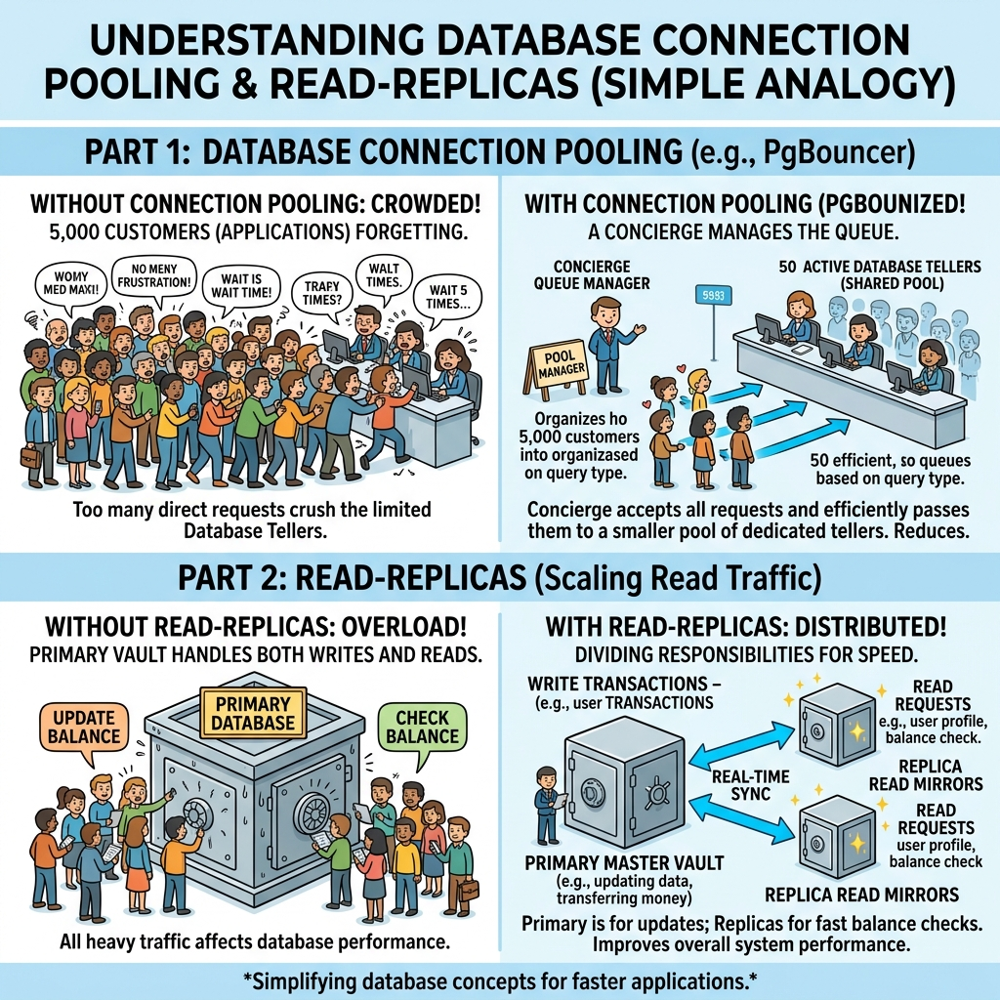

# 📄 Chapter 6: Strategic Future Upgrade Roadmap

> **"How the Application Can Be Upgraded"**  
> *A comprehensive engineering & business blueprint for scaling Riverbrand from a high-performance modular monolith into a global microservices banking platform.*

---

## 6.1 Architectural Evolution: Microservices & Event Streaming

While the current modular monolith architecture excels in performance, developer ergonomics, and operational simplicity, scaling to tens of millions of daily active transactions warrants a phased transition toward a distributed, event-driven microservices architecture.

```
                   CURRENT STATE (Modular Monolith)
┌────────────────────────────────────────────────────────────────────┐
│ Fastify Monolith (User + Wallet + Transfer + Savings + WhatsApp)   │
│ Single PostgreSQL Database + Redis In-Memory Cache                 │
└────────────────────────────────────────────────────────────────────┘
                                   │
                                   ▼
                   TARGET STATE (Microservices & Kafka Event Mesh)
┌────────────────────────────────────────────────────────────────────┐
│                    API GATEWAY & SERVICE MESH                      │
│                  (Kong / Envoy / Cloudflare Access)                │
└────────────────────────────────────────────────────────────────────┘
     │                    │                    │                    │
     ▼                    ▼                    ▼                    ▼
┌─────────┐          ┌─────────┐          ┌─────────┐          ┌─────────┐
│ WALLET  │          │TRANSFER │          │  SAVINGS│          │   KYC   │
│ SERVICE │          │ SERVICE │          │ SERVICE │          │ ENGINE  │
└─────────┘          └─────────┘          └─────────┘          └─────────┘
     │                    │                    │                    │
     └────────────────────┴──────────┬─────────┴────────────────────┘
                                     ▼
                      ┌─────────────────────────────┐
                      │ APACHE KAFKA EVENT BACKBONE │
                      │ Real-Time Streaming & Logs  │
                      └─────────────────────────────┘
```

### 1. Domain-Driven Microservice Decomposition

- **Wallet & Ledger Microservice**: Isolated service handling core balance calculations, atomic debits/credits, pending balances, and double-entry accounting. Runs on dedicated high-memory instances.
- **Transfer & Clearing Microservice**: Manages interbank communication, gateway fallbacks, Providus/Fincra payment routing, and settlement reconciliations.
- **Identity & KYC Microservice**: Dedicated service interfacing with Dojah, Mono, and government databases for BVN, NIN, and address verification.
- **Conversational Channel Microservice**: Decoupled Meta WhatsApp engine allowing high-volume chat webhooks to scale independently without consuming core banking CPU cycles.

### 2. Apache Kafka / RabbitMQ Event Mesh

- Replace polling-based outbox processors with **Apache Kafka** or **RabbitMQ**.
- **Benefits**: Enables real-time event streaming, event replayability, real-time analytics pipelines, and sub-second webhook notifications across microservices.

---

## 6.2 Database Scaling & High Availability

As database read and write IOPS increase, the storage layer must evolve to maintain zero-latency responsiveness.



### Plain-English Non-Technical Explanation

#### 1. What is PgBouncer Connection Pooling? (The Post Office Queue Manager)
- **The Problem Without PgBouncer**: Imagine 5,000 customers all walking into a small physical bank branch at the exact same second, each demanding their own personal teller. The lobby gets crowded, memory crashes, and the front door gets jammed shut.
- **The Solution With PgBouncer**: PgBouncer acts as an elite **Concierge & Queue Manager** at the front door. Instead of spawning 5,000 heavy, expensive database connections, PgBouncer maintains a small, highly efficient pool of 50 active tellers. As thousands of app requests arrive, PgBouncer hands each request to an available teller for a millisecond and immediately reuses that teller for the next customer in line. **Result**: 5,000 app requests are processed seamlessly with zero crashes using just 50 background connections.

#### 2. What are PostgreSQL Read-Replicas? (The Master Vault vs. Display Mirrors)
- **The Problem Without Read-Replicas**: Every time 100,000 users open their mobile apps just to check their active wallet balance or view transaction history (Read operations), they knock on the doors of the main vault where actual money transfers are being written (Write operations). The main vault gets bogged down answering simple balance queries.
- **The Solution With Read-Replicas**: We split the database into one **Primary Master Vault** and multiple **Read-Replica Mirrors**:
  - **Primary Master Vault (Write Database)**: Handles *only* money movement (debits, credits, transfers, Safelock creation).
  - **Read-Replica Mirrors (Read Database)**: Live, synchronized copies that handle 100% of balance checks, profile views, and history searches.
- **Result**: All 100,000 users checking their balance ask the Read Mirrors, leaving the Primary Master Vault 100% free to execute money transfers at lightning speed.

---

### Proposed Technical Storage Upgrades

1. **PgBouncer Connection Pooling**: Deploy PgBouncer proxies in front of PostgreSQL to manage thousands of concurrent client database connection requests with minimal RAM overhead.
2. **PostgreSQL Read-Replicas**: Split database traffic so that 100% of read queries (user dashboards, transaction histories, admin stats) execute against read-only replicas, keeping the primary database dedicated strictly to write transactions.
3. **Multi-Region Distributed Database Migration (CockroachDB / AWS Aurora / GCP Spanner)**: Migrate from single-region PostgreSQL to a distributed SQL cluster (e.g. CockroachDB or Google Cloud Spanner) for multi-region active-active replication, guaranteeing 99.999% uptime.
4. **Multi-Region Redis Cluster**: Upgrade single-node Redis to a geo-distributed Redis Cluster for global session caching and low-latency distributed locks.

---

## 6.3 Real-Time AI/ML Fraud & AML Compliance Engine

Future banking platforms must detect fraudulent transactions before money leaves the ecosystem.

```
[Transaction Initiated] ──► [Feature Extraction Engine]
                                   │
                                   ▼
                   ┌──────────────────────────────────┐
                   │ AI Fraud Risk Score (XGBoost/ML) │
                   │ Evaluates IP, Device ID, Amount  │
                   └──────────────────────────────────┘
                                   │
             ┌─────────────────────┼─────────────────────┐
             ▼                     ▼                     ▼
     [Risk Score < 0.30]   [0.30 <= Score < 0.75]  [Risk Score >= 0.75]
             │                     │                     │
             ▼                     ▼                     ▼
     [Auto-Approve]       [Step-Up OTP / PIN]   [Block & Alert Admin]
```

### Proposed AI/ML Security Capabilities

1. **Real-Time Transaction Risk Scoring**: Evaluates each transfer request against user behavioral models (velocity, unusual location, device fingerprint, transaction size). High-risk transfers automatically trigger step-up multi-factor authentication or manual compliance review.
2. **Automated Anti-Money Laundering (AML) & Sanctions Screening**: Real-time screening of account names and transfer beneficiaries against global PEP (Politically Exposed Persons) and OFAC sanction lists.
3. **Biometric Auth & Passkeys (WebAuthn / FIDO2)**: Implement Passkeys allowing users to authorize payments using device Face ID / Touch ID instead of 4-digit PINs, drastically reducing phishing vulnerabilities.

---

## 6.4 Product & Enterprise Expansion Capabilities

### 1. Multi-Tenant White-Label Banking Platform
- Evolve the codebase into a **Multi-Tenant SaaS Banking Architecture**.
- Enables Riverbrand to license its digital banking backend to third-party microfinance banks, credit unions, and corporate partners with custom branding, tenant-isolated schemas, and white-labeled mobile apps.

### 2. Open Banking Developer APIs (REST & GraphQL)
- Expose secure Open Banking APIs for external fintech developers.
- Supports OAuth2 / OIDC authorization scopes, allowing third-party apps to build budget trackers, accounting integrations, and payroll processors on top of Riverbrand rails.

### 3. Cross-Border FX Remittance & SWIFT / ISO20022 Engine
- Extend multi-currency wallets to support international wire transfers via SWIFT, ISO20022 messaging, and local clearing networks (ACH, SEPA, FedNow).

---

## 6.5 DevOps, Infrastructure & CI/CD Evolution

```
[Git Commit / Tag] ──► [Automated Unit & E2E Tests] ──► [Build Docker Container]
                                                               │
                                                               ▼
[Kubernetes Helm Release] ◄── [Blue/Green Zero-Downtime Deployment] ◄── [Push to Container Registry]
```

### Target Infrastructure Metrics

| Operational Metric | Current Benchmark | Upgrade Target Benchmark |
| :--- | :--- | :--- |
| **Deployment Strategy** | Docker Compose / Manual Script | Kubernetes Helm Blue/Green Deployment (Zero Downtime) |
| **Recovery Point Objective (RPO)** | < 1 Hour | < 1 Minute (Continuous WAL Streaming) |
| **Recovery Time Objective (RTO)** | < 15 Minutes | < 5 Minutes (Automated Failover) |
| **Infrastructure Provisioning** | Manual Shell / Compose | Terraform Infrastructure-as-Code (IaC) |
| **Target Availability (SLA)** | 99.9% Uptime | 99.999% High Availability |

---

## 6.6 Summary Roadmap Timeline

```
Q1 - Q2 2027                    Q3 - Q4 2027                    2028 & Beyond
─────────────────────────────   ─────────────────────────────   ─────────────────────────────
• PgBouncer & Read-Replicas     • Kafka Event Backbone          • Full Microservices Split
• AI Fraud Scoring Engine       • Biometric Passkeys (FIDO2)    • Multi-Tenant White Labeling
• Automated AML Sanctions       • Kubernetes (EKS/GKE) Helm     • Global FX Remittance Engine
```

*Next Chapter: [07. Developer & Operations Manual](./07-developer-and-operations-manual.md) — Engineering & Operations Playbook.*
