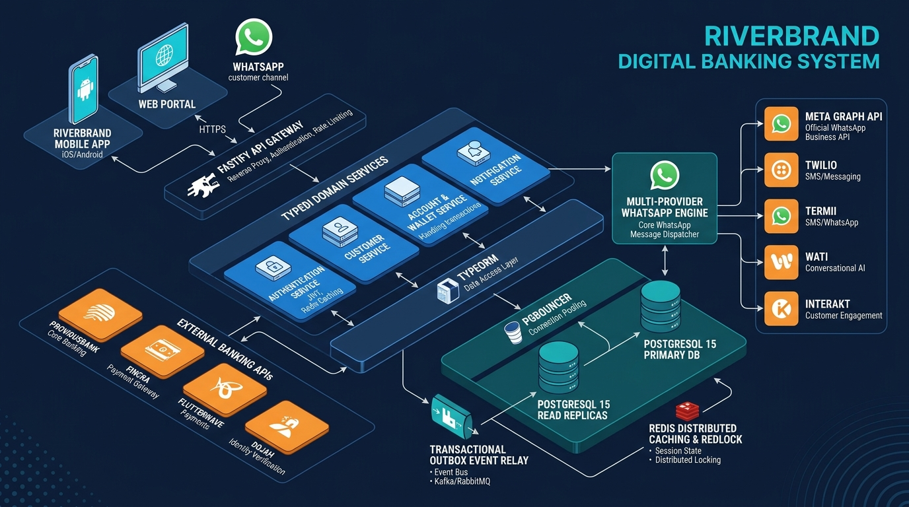
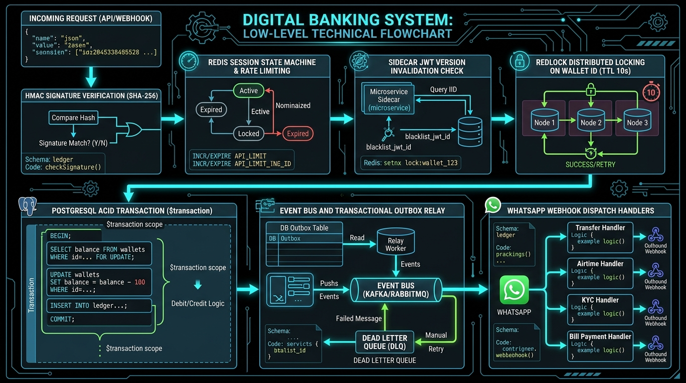
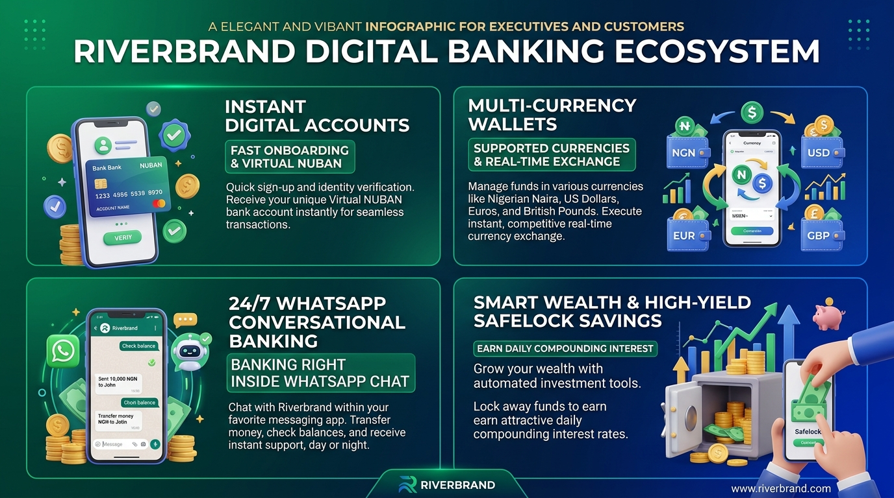
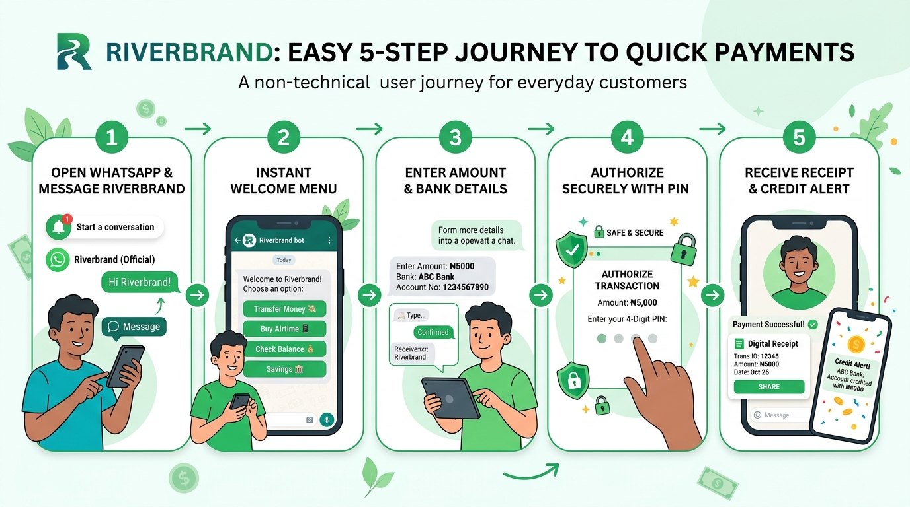

# 🏦 Riverbrand Enterprise Digital Banking System Documentation

> **Authoritative Technical & Architectural Reference Suite**  
> *Written by Senior Principal Financial Systems Engineering*  
> **Repository:** `git@github.com:blurbeast/riverbank_river_brand_docs.git`  
> **Platform Version:** 1.0.0 Enterprise Release | **Target Stack:** Node.js v20 / Fastify / TypeScript / PostgreSQL / Redis / Docker

---

## 📌 Executive Summary & Master Navigation

Welcome to the official, end-to-end documentation suite for **Riverbrand Enterprise Digital Banking Engine** (`RiverbrandBE`). 

This documentation hub is designed to bridge the gap between high-level executive understanding and low-level software engineering precision. Whether you are an executive officer, investor, product manager, financial auditor, systems architect, or core backend developer, this repository provides complete clarity on **what the platform does**, **how it was built**, **how it operates securely**, and **how it can be strategically upgraded for global scale**.

```mermaid
graph TD
    User[📱 Mobile & Web Clients] -->|Dual-Token Auth| API Gateway[⚡ Fastify API Engine]
    WhatsApp[💬 WhatsApp Chat Users] -->|Webhooks / HMAC| WABridge[🔌 Multi-Provider WhatsApp Bridge]
    WABridge -->|Meta, Twilio, Termii, Wati, Interakt, 360dialog| WABanking[📱 Conversational Banking Engine]
    
    API Gateway -->|Auth & Session| Sidecar[🛡️ Session & Revocation Control]
    API Gateway -->|Business Logic| DomainServices[🏦 Core Financial Domain Services]
    WABanking --> DomainServices
    
    DomainServices -->|Atomic Lock & Tx| DB[(🐘 PostgreSQL 15 Primary DB)]
    DomainServices -->|Token Bucket & Cache| Cache[(⚡ Redis 7 In-Memory Cache)]
    DomainServices -->|Outbox Relay| Outbox[📬 Transactional Outbox & DLQ]
    DomainServices -->|In-Memory Bus| EventBus[📢 Event Bus & Handlers]
    
    Outbox -->|External APIs| Integrations[🌐 Providus, Fincra, Flutterwave, Dojah, Termii]
```

---

## 🖼️ Architectural & Ecosystem Diagram Gallery

To serve all stakeholders across executive, product, architecture, and engineering domains, the system is fully visualized across four core visual perspectives:

| Perspective | Diagram & Visual Reference | Primary Target Audience |
| :--- | :--- | :--- |
| **Technical High-Level** |  | CTOs, Solutions Architects, Lead Engineers |
| **Technical Low-Level** |  | Core Backend Engineers, Security Auditors, DevOps |
| **Non-Technical High-Level** |  | C-Level Executives, Investors, Product Managers |
| **Non-Technical Low-Level** |  | Product Leads, Customer Support, Operations |

---

## 📚 Complete Document Library Index

The documentation suite is structured into 8 dedicated chapters:

| Document | Focus & Audience | Key Topics Covered |
| :--- | :--- | :--- |
| 📄 [**01. Executive & Product Overview**](./01-executive-overview.md) | **Non-Technical / C-Suite / Operations** | Business value, banking ecosystem infographic, core product capabilities, wallet system, NUBAN provisioning, Safelock savings, conversational WhatsApp banking, KYC compliance, 5-currency user journeys. |
| 📄 [**02. Architecture & System Topology**](./02-architecture-and-design.md) | **Architects / Lead Engineers** | Microservice-ready modular monolith, Technical High-Level Architecture, Low-Level Execution Flow, PgBouncer connection pooling, Prisma read replicas, Event Bus, Outbox pattern, Prometheus metrics. |
| 📄 [**03. Core Banking & Financial Engine**](./03-core-banking-and-financial-engine.md) | **Financial Engineers / Auditors** | Atomic balance locking, double-spending guard (`Redlock`), interbank & P2P transfers, pending balance hold/release mechanics, KYC daily transaction ceilings. |
| 📄 [**04. Savings, WhatsApp & Channels**](./04-savings-investments-and-channels.md) | **Product Engineers / Channel Leads** | Safelock fixed deposits, Target Savings, AutoSave sweeps, Multi-Provider WhatsApp Engine (Meta, Twilio, Termii, Wati, Interakt, 360dialog), Redis session state machine, conversational handlers, FCM push notifications. |
| 📄 [**05. Security, Revocation & Auditing**](./05-security-compliance-and-auditing.md) | **Security Officers / Compliance** | Dual-Token isolation (`x-local-access-token` vs `x-web-access-token`), sidecar session invalidation (`jwt_version`), Argon2/bcrypt PINs, multi-channel OTP failover, WhatsApp HMAC webhook signatures, RBAC matrix, non-blocking audit trails. |
| 📄 [**06. Future Strategic Upgrade Roadmap**](./06-future-upgrade-roadmap.md) | **CTO / VP Engineering / Product Strategy** | Microservices decomposition blueprint, Kafka event streaming, multi-region database replication, AI/ML real-time fraud detection engine, automated AML screening, Open Banking APIs. |
| 📄 [**07. Developer & Operations Manual**](./07-developer-and-operations-manual.md) | **DevOps / Backend Engineers** | Local setup guide, Docker Compose deployment, environment variables catalog, database migrations, WhatsApp webhook testing & scripts, interactive Scalar/Swagger UI docs, troubleshooting playbook. |
| 📄 [**08. Complete Backend Service Catalog**](./08-service-catalog-and-deep-dive.md) | **Core Backend Engineers / System Auditors** | Line-by-line service specifications for all 36+ core backend services, WhatsApp providers, handlers, DTO payloads, database entities, external dependencies, error codes, and configuration switches. |

---

## 🎯 Quick Navigation by Role

### 💼 For C-Level Executives, Investors & Non-Technical Stakeholders
- Start with **[Chapter 01: Executive & Product Overview](./01-executive-overview.md)** for the high-level banking ecosystem and visual user journeys.
- Review **[Chapter 06: Future Strategic Upgrade Roadmap](./06-future-upgrade-roadmap.md)** for long-term growth, scalability options, and international banking expansion.

### 🛡️ For Information Security, Risk & Compliance Officers
- Deep-dive into **[Chapter 05: Security, Revocation & Auditing](./05-security-compliance-and-auditing.md)** to inspect authentication token isolation, sidecar JWT versioning, instant token revocation, WhatsApp HMAC webhook security, and non-repudiable audit logging.
- Read **[Chapter 03: Core Banking & Financial Engine](./03-core-banking-and-financial-engine.md)** for double-spending safeguards and daily transaction volume ceilings per KYC tier.

### 💻 For Core Engineers, Architects & Systems Developers
- Study **[Chapter 02: Architecture & System Topology](./02-architecture-and-design.md)** for technical architecture blueprints, low-level execution flows, dependency injection, and database ORM designs.
- Examine **[Chapter 04: Savings, WhatsApp & Channels](./04-savings-investments-and-channels.md)** and **[Chapter 08: Backend Service Catalog](./08-service-catalog-and-deep-dive.md)** for WhatsApp multi-provider architecture, session state machines, handlers, and domain services.

### 🚀 For DevOps, Infrastructure & Reliability Engineers
- Follow **[Chapter 07: Developer & Operations Manual](./07-developer-and-operations-manual.md)** for local container stacks, WhatsApp webhook debugging, Mailpit email mocking, Prometheus metric scraping, Docker Compose production profiles, and recovery playbooks.

---

## 🛠️ Tech Stack At A Glance

- **Runtime Engine**: Node.js v20 (LTS) with TypeScript 5.x
- **Web Application Framework**: Fastify 4.x / 5.x (High-throughput non-blocking HTTP)
- **Data Persistence**: PostgreSQL 15 with Prisma ORM 5.x & PgBouncer Connection Pooler
- **Cache & Distributed Locking**: Redis 7.x (In-memory token bucket rate limiting, distributed `Redlock`, and WhatsApp conversational state machine)
- **WhatsApp Multi-Provider Bridge**: Meta Graph API v18+, Twilio Programmable Messaging, Termii WhatsApp API, Wati, Interakt, 360dialog
- **Messaging & Notifications**: Mailpit (Development SMTP), SendGrid / Brevo (Production Email), Firebase Cloud Messaging (FCM Push), Termii / Twilio (SMS OTP)
- **Payment & Identity Providers**: ProvidusBank (Virtual NUBAN), Fincra (Virtual Accounts & Settlements), Flutterwave (Cards & Transfers), Dojah (BVN / NIN Identity Verification)
- **Containerization & Metrics**: Docker Compose, Prometheus, Grafana

---

## ⚖️ Intellectual Property & Confidentiality

Copyright © 2026 **Riverbrand Partners**. All Rights Reserved.  
Confidential and proprietary documentation for internal systems engineering, executive governance, and authorized technical partner integration.
